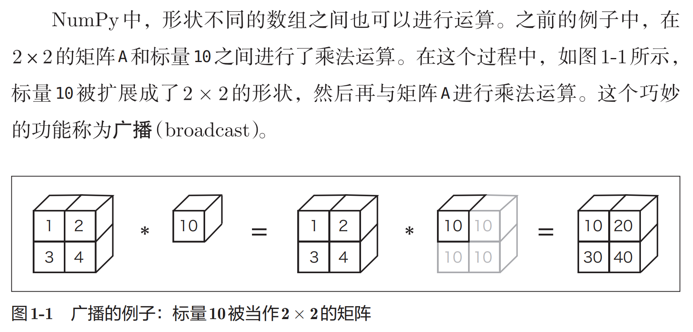

# Chapter1

> 《深度学习入门：基于Python的理论与实现》

## 概念1

NumPy数组（np.array）可以生成N维数组，即可以生成一维数组、
二维数组、三维数组等任意维数的数组。数学上将一维数组称为向量，
将二维数组称为矩阵。另外，可以将一般化之后的向量或矩阵等统
称为张量（tensor）。本书基本上将二维数组称为“矩阵”，将三维数
组及三维以上的数组称为“张量”或“多维数组”。

## 广播

