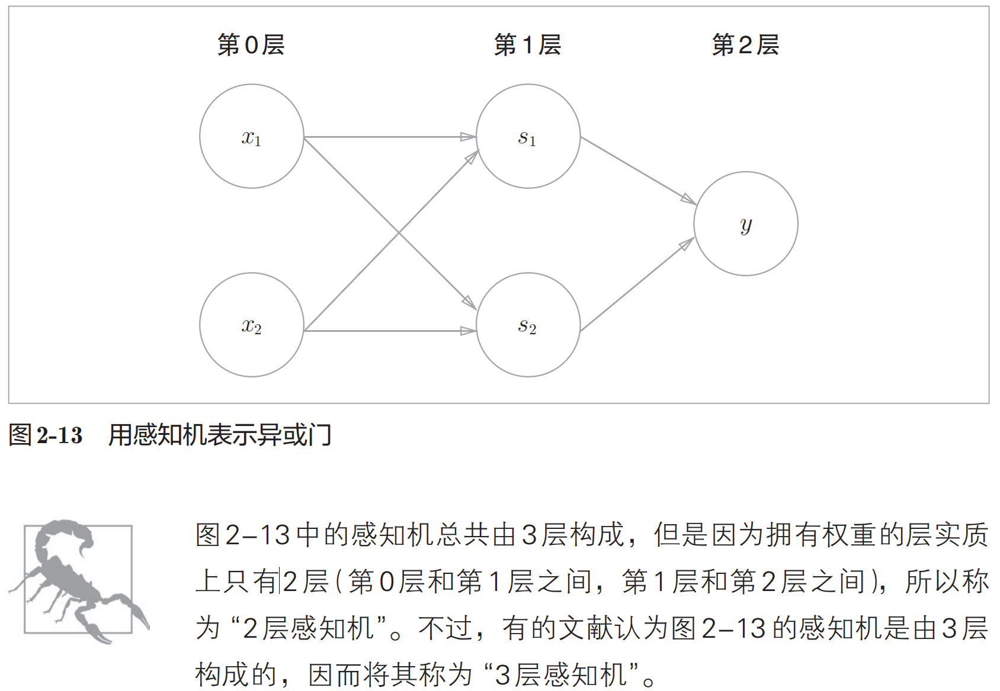

# 感知机 perceptron

感知机的信号只有“流/不流”（1/0）两种取值。只有当总和超过了某个界限值时，才会输出1。这也称为“神经元被激活”。这里将这个界限值称为阈值，用符号θ表示。

## 问题1: 感知机是线性的, 无法分割非线性空间

**重点**: 感知机可以实现与或非门但是无法实现异或门! 因为这个异或门是非线性的! 无法用一条直线分开! 

曲线分割而成的空间称为非线性空间，由直线分割而成的空间称为线性空间。

## 解决1: 可以通过叠层解决无法实现异或门的问题

1. 第0层的两个神经元接收输入信号，并将信号发送至第1层的神经元。
2. 第1层的神经元将信号发送至第2层的神经元，第2层的神经元输出y。

通过这样的结构（2层结构），感知机得以实现异或门。这可以解释为“单层感知机无法表示的东西，通过增加一层就可以解决”。也就是说，通过叠加层（加深层），感知机能进行更加灵活的表示。

感知机通过叠加层能够进行非线性的表示，理论上还可以表示计算机进行的处理。
