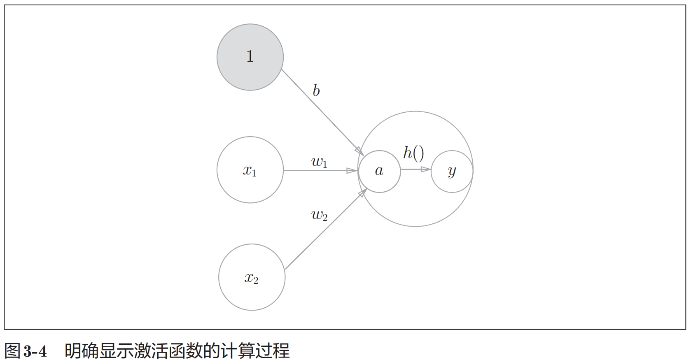
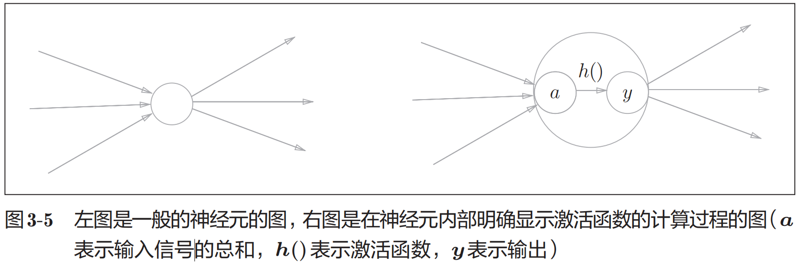
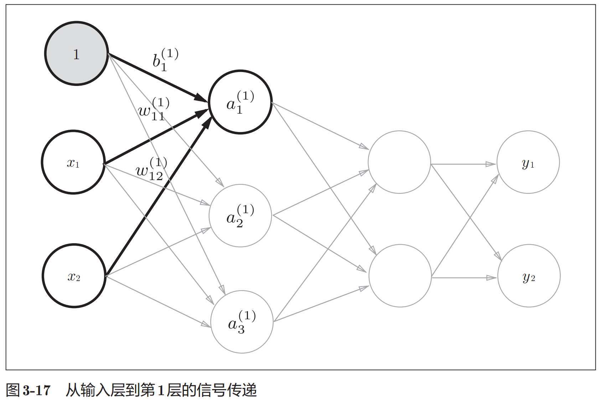

# Neural network

把最左边的一列称为输入层，最右边的一列称为输出层，中间的一列称为中间层。中间层有时也称为隐藏层。“隐藏”一词的意思是，隐藏层的神经元（和输入层、输出层不同）肉眼看不见。

```
神经元0-1 --- 神经元1-1 --- 神经元2-1
          |- 神经元1-2 -|
神经元0-2 --- 神经元1-3 --- 神经元2-2

输入层(0) --- 中间层(1) --- 输出层(2)
```

**注意** 图中的网络一共由 3层神经元构成，但实质上只有 2层神经元有权重，因此将其称为“2层网络”。请注意，有的书也会根据构成网络的层数，把图中的网络称为“3层网络”。本书将根据实质上拥有权重的层数（输入层、隐藏层、输出层的总数减去 1后的数量）来表示网络的名称。

## 神经元

### 公式

$$ y = h( b + w_1 * x_1 + w_2 * x_2 ) $$

刚才登场的 $h(x)$ 函数会将输入信号的总和转换为输出信号，这种函数一般称为激活函数（activation function）。如“激活”一词所示，激活函数的作用在于决定如何来激活输入信号的总和。





### sigmoid激活函数

$$ h(x) = \frac{1}{1 + \exp{(-x)}} $$

### ReLU（Rectified Linear Unit）函数

$$ y = max(0, x) $$

### 神经元的矩阵实现



这里需要注意, 偏置项的实现, 其实就是认为输入多了一个固定的1, 对应的多一列权重 $b$ 

写成矩阵形式: 

$$ A^{(1)} = X W^{(1)} + B^{(1)} $$

其中 A 是1x3的， X 是2x1的， B 是1x3的， W 是2x3的

### softmax

$$ y_k = \frac{\exp{(a_k)}}{\sum_{i=1}^{n}\exp{(a_i)}} = \frac{\exp{(a_k + C^\prime)}}{\sum_{i=1}^{n}\exp{(a_i + C^\prime)}}  $$


