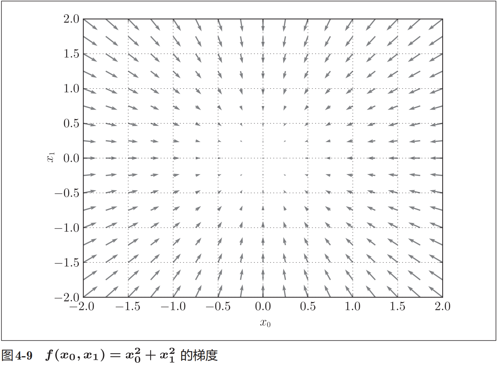
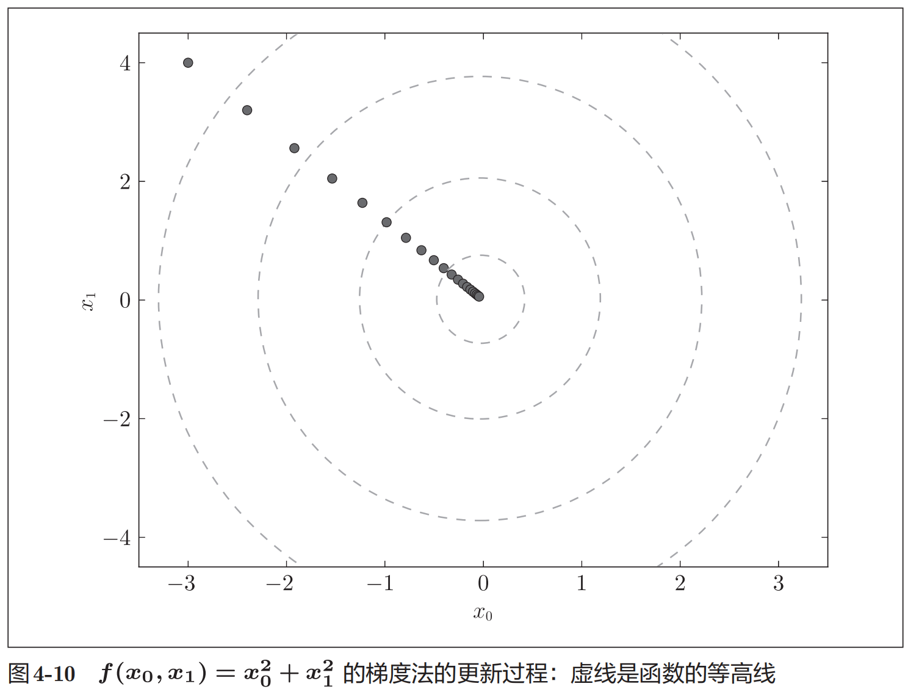

# 神经网络的学习

## 概念

为了正确评价模型的泛化能力，就必须划分训练数据和测试数据。另外，训练数据也可以称为监督数据。

泛化能力是指处理未被观察过的数据（不包含在训练数据中的数据）的能力。获得泛化能力是机器学习的最终目标。

只对某个数据集过度拟合的状态称为过拟合（over fitting）。避免过拟合也是机器学习的一个重要课题。

## 损失函数

### 均方误差

$$ E = \frac{1}{2} \sum_k {(y_k - t_k)^2} $$

### 交叉熵误差（cross entropy error）

$$ E = - \sum{t_k \log{y_k}} $$

yk是神经网络的输出，tk是正确解标签。并且，tk中只有正确解标签的索引为1，其他均为0（one-hot表示）。
因此，交叉熵误差实际上只计算对应正确解标签的输出的自然对数。
也就是说，交叉熵误差的值是由正确解标签所对应的输出结果决定的。

## note

### 二维梯度的图像

严格地讲，梯度指示的方向是各点处的函数值减小最多的方向。这是一个非常重要的性质，请一定牢记！

> 函数的极小值、最小值以及被称为鞍点（saddle point）的地方，梯度为 0。极小值是局部最小值，也就是限定在某个范围内的最小值。鞍点是从某个方向上看是极大值，从另一个方向上看则是极小值的点。虽然梯度法是要寻找梯度为 0的地方，但是那个地方不一定就是最小值（也有可能是极小值或者鞍点）。此外，当函数很复杂且呈扁平状时，学习可能会进入一个（几乎）平坦的地区，陷入被称为“学习高原”的无法前进的停滞期。

虽然梯度的方向并不一定指向最小值，但沿着它的方向能够最大限度地减小函数的值。因此，在寻找函数的最小值（或者尽可能小的值）的位置的任务中，要以梯度的信息为线索，决定前进的方向。

> 根据目的是寻找最小值还是最大值，梯度法的叫法有所不同。严格地讲，寻找最小值的梯度法称为梯度下降法gradient descent method），寻找最大值的梯度法称为梯度上升法（gradient ascent method）。但是通过反转损失函数的符号，求最小值的问题和求最大值的问题会变成相同的问题，因此“下降”还是“上升”的差异本上并不重要。一般来说，神经网络（深度学习）中，梯度法主要是指梯度下降法。

### 梯度法的图像

学习率过大的话，会发散成一个很大的值；反过来，学习率过小的话，基本上没怎么更新就结束了。也就是说，设定合适的学习率是一个很重要的问题。

> 像学习率这样的参数称为超参数。这是一种和神经网络的参数（权重和偏置）性质不同的参数。相对于神经网络的权重参数是通过训练数据和学习算法自动获得的，学习率这样的超参数则是人工设定的。一般来说，超参数需要尝试多个值，以便找到一种可以使学习顺利进行的设定。

> epoch是一个单位。一个 epoch表示学习中所有训练数据均被使用过一次时的更新次数。比如，对于 10000笔训练数据，用大小为 100笔数据的mini-batch进行学习时，重复随机梯度下降法 100次，所有的训练数据就都被“看过”了A。此时，100次就是一个 epoch。

