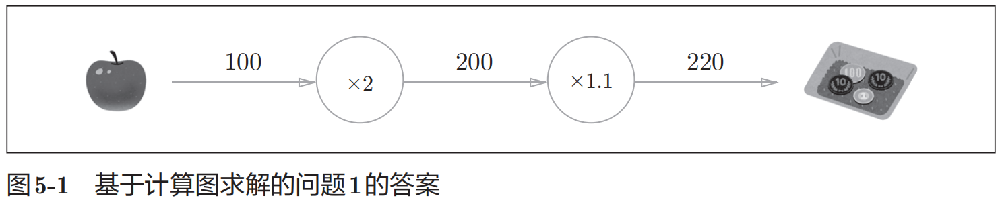
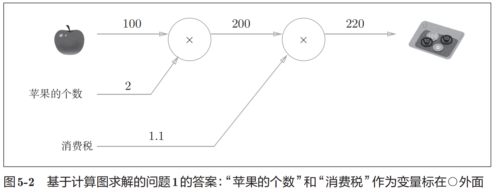
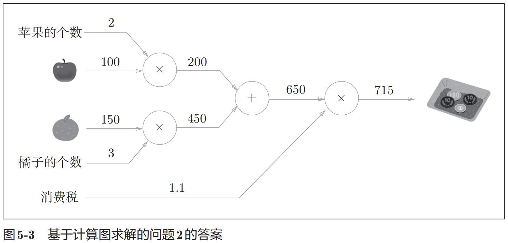
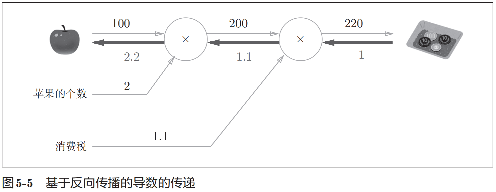
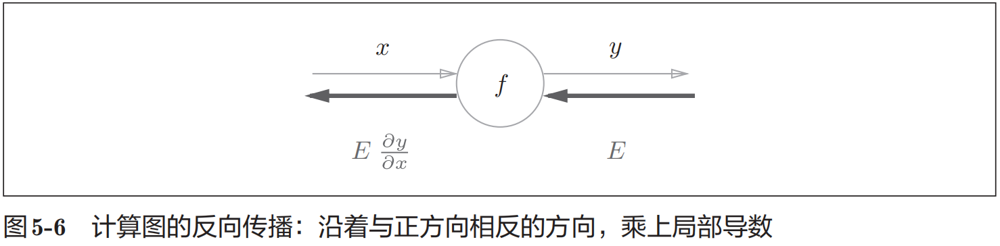
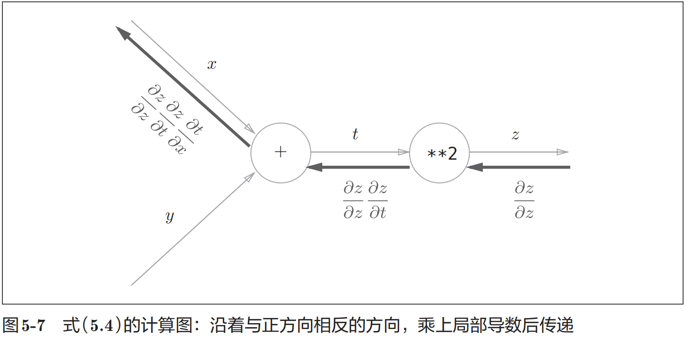
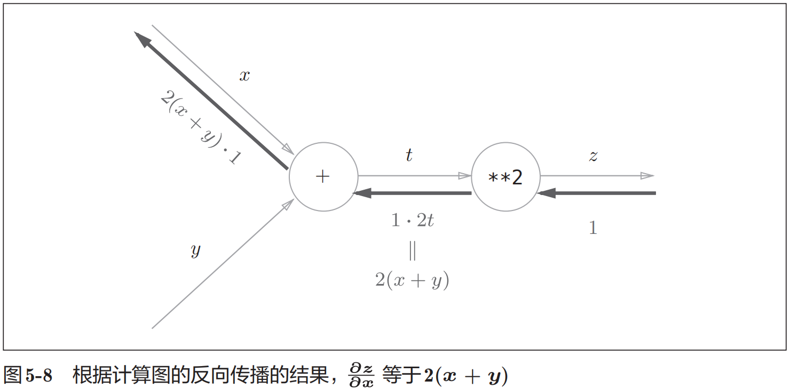
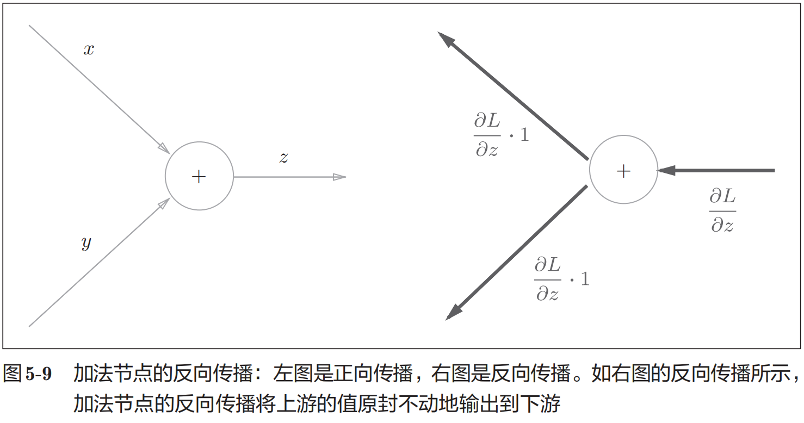
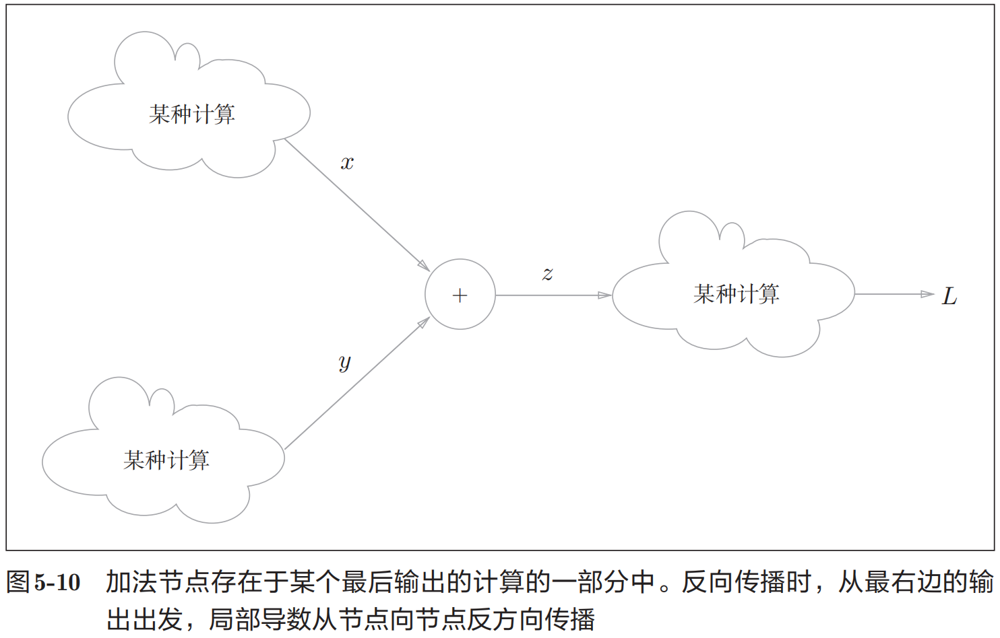
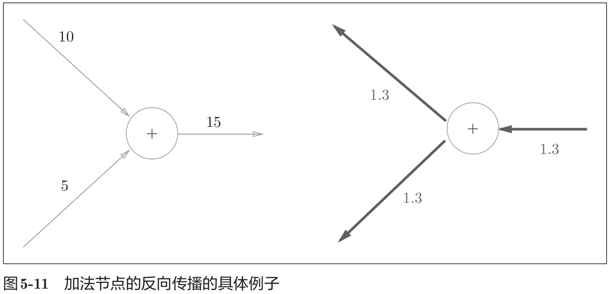

# 反向传播算法

> 《鱼书》里第五章最需要认真看的部分：
> 1. p143页对于sigmoid的求导计算图推导极为精彩!
> 2. p145页对于矩阵的求导的计算图和推导很重要!

## 概念

误差的反向传播算法：
1. 基于数学式
2. 基于**计算图**

## 计算图

### 概念

计算图将计算过程用图形来表示，具体来说，这个图是数据结构图，通过多个节点和边表示。

### 例子

问题1：太郎在超市买了2个100日元一个的苹果，消费税是10%，请计算支付金额。





问题2：太郎在超市买了2个苹果、3个橘子。其中，苹果每个100日元，橘子每个150日元。消费税是10%，请计算支付金额。



总结：计算的流程：
1. 构建计算图
2. 从左到右进行计算

注意，从左到右是**正向传播(forward propagation)**
还有，从右向左是**反向传播(backward propagation)**

### 局部计算

计算图的特征是可以通过传递“局部计算”获得最终结果。“局部”这个词的意思是“与自己相关的某个小范围”。局部计算是指，无论全局发生了什么，都能只根据与自己相关的信息输出接下来的结果。

计算图可以集中精力于局部计算。无论全局的计算有多么复杂，各个步骤所要做的就是对象节点的局部计算。虽然局部计算非常简单，但是通过传递它的计算结果，可以获得全局的复杂计算的结果。

> 比如，组装汽车是一个复杂的工作，通常需要进行“流水线”作业。每个工人（机器）所承担的都是被简化了的工作，这个工作的成果会传递给下一个工人，直至汽车组装完成。计算图将复杂的计算分割成简单的局部计算，和流水线作业一样，将局部计算的结果传递给下一个节点。在将复杂的计算分解成简的计算这一点上与汽车的组装有相似之处。

### 为何用计算图解题(优点)

1. 局部计算。无论全局是多么复杂的计算，都可以通过局部计算使各个节点致力于简单的计算，从而简化问题。

2. 利用计算图可以将中间的计算结果全部保存起来（比如，计算进行到2个苹果时的金额是200日元、加上消费税之前的金额650日元等）。但是只有这些理由可能还无法令人信服。实际上，使用计算图最大的原因是，可以通过反向传播高效计算导数。

### 计算导数

在介绍计算图的反向传播时，我们再来思考一下问题1。问题1中，我们计算了购买2个苹果时加上消费税最终需要支付的金额。这里，假设我们想知道苹果价格的上涨会在多大程度上影响最终的支付金额，即求“支付金额关于苹果的价格的导数”。设苹果的价格为x，支付金额为L，则相当于求 $ \frac{ \partial L }{ \partial x } $ 。这个导数的值表示当苹果的价格稍微上涨时，支付金额会增加多少。

如前所述，“支付金额关于苹果的价格的导数”的值可以通过计算图的反向传播求出来。先来看一下结果，如图5-5所示，可以通过计算图的反向传播求导数（关于如何进行反向传播，接下来马上会介绍）。



反向传播传递“局部导数”，将导数的值写在箭头的下方。

这里只求了关于苹果的价格的导数，不过“支付金额关于消费税的导数”“支付金额关于苹果的个数的导数”等也都可以用同样的方式算出来。并且，计算中途求得的导数的结果（中间传递的导数）可以被共享，从而可以高效地计算多个导数。综上，计算图的优点是，可以通过正向传播和反向传播高效地计算各个变量的导数值。

## 链式法则(chain rule)

反向传播将局部导数向正方向的反方向（从右到左）传递，一开始可能会让人感到困惑。
传递这个局部导数的原理，是基于链式法则（chain rule）的。

## 计算图的反向传播



f的上半部分是数据的正向传播过程的数据流动，
但是求导是反过来的，看到下面，对于f这个算子的求导
就是f的输出y对于输入x的求导，也就是 $\frac {\partial y} {\partial x}$
然后E是f之后所有的运算求取出的导数值，所以，根据链式法则，
f的左下角计算出的导数就是自己的导数乘上E。

链式法则的理论基础就是：
如果某个函数由复合函数表示，则该复合函数的导数可以用构成复合函数的各个函数的导数的乘积表示。

或者说，你对 $z = (x + y)^2$ 这玩意儿求一次导数你观察一下公式就懂了。 

现在这么拆开： $z = t^2 $ 和 $ t = x + y $ 

求导公式： 

$$ \frac{\partial z}{\partial x} = \frac{\partial z}{\partial t} \frac{\partial t}{\partial x} \\ 
= 2t \times 1 \\ 
= 2( x + y ) $$

对于这部分，画出计算图：





## 反向传播

对于每个节点进行求导分析。







乘法是类似的，但是注意到一点：实现乘法节点的反向传播时，要 **保存** 正向传播的输入信号。

## 方法对比

误差反向传播法的梯度确认

1. 数值微分算法：计算很耗费时间，数值微分的优点是实现简单，因此，一般情况下不太容易出错。
2. 误差反向传播：就是计算图，即使存在大量的参数，也可以高效地计算梯度。节省极其大量的时间！

所以，经常会比较数值微分的结果和误差反向传播法的结果，以确认误差反向传播法的实现是否正确。确认数值微分求出的梯度结果和误差反向传播法求出的结果是否一致（严格地讲，是非常相近）的操作称为 **梯度确认（gradient check）** 。

梯度确认的代码实现

```python
import sys, os
sys.path.append(os.pardir)
import numpy as np
from dataset.mnist import load_mnist
from two_layer_net import TwoLayerNet

# 读入数据
(x_train, t_train), (x_test, t_test) =  load_mnist(normalize=True, one_hot_label = True)
network = TwoLayerNet(input_size=784, hidden_size=50, output_size=10)
x_batch = x_train[:3]
t_batch = t_train[:3]

grad_numerical = network.numerical_gradient(x_batch, t_batch)
grad_backprop = network.gradient(x_batch, t_batch)

# 求各个权重的绝对误差的平均值
for key in grad_numerical.keys():
    diff = np.average( np.abs(grad_backprop[key] - grad_numerical[key]) )
    print(key + ":" + str(diff))
# 打印出的结果应该是e-11左右的数量级
```

> 数值微分和误差反向传播法的计算结果之间的误差为 0是很少见的。这是因为计算机的计算精度有限（比如，32位浮点数）。受到数值精
度的限制，刚才的误差一般不会为 0，但是如果实现正确的话，可以期待这个误差是一个接近 0的很小的值。如果这个值很大，就说明误差反向传播法的实现存在错误。
