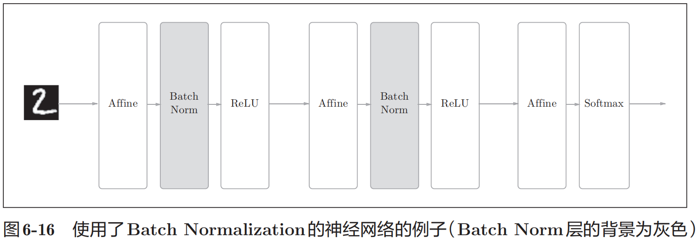
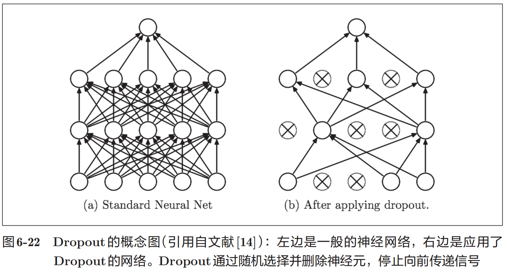

# 与学习相关的技巧

## 参数的更新

### SGD

随机梯度下降法（stochastic gradient descent），简称SGD。  
问题： SGD的缺点是，如果函数的形状非均向（anisotropic），比如呈延伸状，搜索的路径就会非常低效。  
（就比如，报纸对折之后形成的这个曲面，你梯度下降会不断的冲到对面，然后又冲回来）

### Momentum(动量)

公式:  

$$ 
\boldsymbol{v} \leftarrow \alpha \boldsymbol{v} - \eta \frac{\partial L}{\partial \boldsymbol{W}}
$$

$$
\boldsymbol{W} \leftarrow \boldsymbol{W} + \boldsymbol{v}
$$

这里的 $W$ 是需要更新的权重； $\eta$ 是学习率； $v$ 是速度。  
所以，前一个式子其实表示的是受力，也就是 $\alpha v$ 是“记录惯性”在减去原来的梯度进行下降，所以最后更新权重时时用加法的。

### AdaGrad

在关于学习率的有效技巧中，有一种 **学习率衰减（learning rate decay）** 的方法，即随着学习的进行，使学习率逐渐减小。

公式:

$$ h \leftarrow h + \frac{\partial L}{\partial W} \odot \frac{\partial L}{\partial W} \\ W \leftarrow W - \eta \frac{1}{\sqrt{h}} \frac{\partial L}{\partial W} $$

$h$ 保存了以前的所有梯度值的平方和；$\odot$ 表示对应矩阵元素的乘法。  
对h的根号倒数，就是调整学习速率的关键！也就是当梯度很大的时候，这个倒数很小，就能保证权重更新时，步子不要迈的太大，反之亦然。

> AdaGrad会记录过去所有梯度的平方和。因此，学习越深入，更新的幅度就越小。实际上，如果无止境地学习，更新量就会变为 0，完全不再更新。为了改善这个问题，可以使用 RMSProp [7]方法。RMSProp方法并不是将过去所有的梯度一视同仁地相加，而是逐渐地遗忘过去的梯度，在做加法运算时将新梯度的信息更多地反映出来。这种操作从专业上讲，称为“指数移动平均”，呈指数函数式地减小过去的梯度的尺度。

### Adam

结合Momentum和AdaGrad的方法。

## 权重的初始值

权重的初始值特别重要。

抑制过拟合、提高泛化能力的技巧——权值衰减（weight decay）。简单地说，权值衰减就是一种以减小权重参数的值为目的进行学习的方法。通过减小权重参数的值来抑制过拟合的发生。

如果想减小权重的值，一开始就将初始值设为较小的值才是正途。  
如果我们把权重初始值全部设为0以减小权重的值，会怎么样呢？从结论来说，将权重初始值设为0不是一个好主意。  
事实上，将权重初始值设为0的话，将无法正确进行学习。

为什么不能将权重初始值设为0呢？严格地说，为什么不能将权重初始值设成一样的值呢？这是因为在误差反向传播法中，所有的权重值都会进行相同的更新。

因此，权重被更新为相同的值，并拥有了对称的值（重复的值）。  
这使得神经网络拥有许多不同的权重的意义丧失了。为了防止“权重均一化”（严格地讲，是为了瓦解权重的对称结构），必须随机生成初始值。

这里使用的sigmoid函数是S型函数，随着输出不断地靠近0（或者靠近1），它的导数的值逐渐接近0。因此，偏向0和1的数据分布会造成反向传播中梯度的值不断变小，最后消失。这个问题称为 **梯度消失（gradient vanishing）** 。层次加深的深度学习中，梯度消失的问题可能会更加严重。

这次呈集中在0.5附近的分布。因为不像刚才的例子那样偏向0和1，所以不会发生梯度消失的问题。但是，激活值的分布有所偏向，说明在表现力上会有很大问题。比如，如果100个神经元都输出几乎相同的值，那么也可以由1个神经元来表达基本相同的事情。因此，激活值在分布上有所偏向会出现“表现力受限”的问题。

> 各层的激活值的分布都要求有适当的广度。为什么呢？因为通过在各层间传递多样性的数据，神经网络可以进行高效的学习。反过来，如果传递的是有所偏向的数据，就会出现梯度消失或者“表现力受限”的问题，导致学习可能无法顺利进行。

现在，在一般的深度学习框架中，Xavier初始值已被作为标准使用。

### 结论: Xavier初始值 一般是更好的

推导出的结论是，如果前一层的节点数为n，则初始值使用标准差为 $ \frac{1}{\sqrt{n}}$ 的分布.

### ReLU

Xavier初始值是以激活函数是线性函数为前提而推导出来的。因为sigmoid函数和tanh函数左右对称，且中央附近可以视作线性函数，所以适合使用Xavier初始值。但当激活函数使用ReLU时，一般推荐使用ReLU专用的初始值，也就是Kaiming He等人推荐的初始值，也称为“He初始值”。

当前一层的节点数为n时，He初始值使用标准差为 $ \sqrt{ \frac{2}{n} } $ 的高斯分布。

简单理解: 因为ReLU的负值区域的值为0，为了使它更有广度，所以需要2倍的系数。

### 总结

总结一下，当激活函数使用ReLU时，权重初始值使用He初始值，当激活函数为sigmoid或tanh等S型曲线函数时，初始值使用Xavier初始值。这是目前的最佳实践。

## Batch Normalization

Batch Norm有以下优点
1. 可以使学习快速进行（可以增大学习率）。
2. 不那么依赖初始值（对于初始值不用那么神经质）。
3. 抑制过拟合（降低Dropout等的必要性）。

Batch Norm的思路是调整各层的激活值分布使其拥有适当的广度。为此，要向神经网络中插入对数据分布进行正规化的层，即Batch Normalization层（下文简称Batch Norm层），如图:

Batch Norm，顾名思义，以进行学习时的mini-batch为单位，按mini batch进行正规化。具体而言，就是进行使数据分布的均值为0、方差为1的正规化。用数学式表示的话，如下所示。
批归一化（Batch Normalization）的核心计算步骤：  

1. 第一个公式为 

$$ \mu_B \leftarrow \frac{1}{m} \sum_{i=1}^{m} x_i $$

其中 $\mu_B$ 表示批（batch）的均值，$m$ 是批大小，$ x_i $ 是批内第 $ i $ 个样本，该式计算批内所有样本的平均值。

2. 第二个公式为

$$ \sigma_B^2 \leftarrow \frac{1}{m} \sum_{i=1}^{m} (x_i - \mu_B)^2 $$

其中 $ \sigma_B^2 $ 表示批的方差，该式计算批内样本与均值差的平方的平均值。 

3. 第三个公式为 

$$ \hat{x}_i \leftarrow \frac{x_i - \mu_B}{\sqrt{\sigma_B^2 + \varepsilon }} $$

其中 $ \hat{x}_i $ 是归一化后的样本，$ \varepsilon $ 是一个很小的常数（如 $ 10^{-5} $），用于防止分母为零，该式对批内每个样本进行归一化处理，使其均值为 0、方差为 1（近似）。

$$ y_i \leftarrow \gamma \hat{x}_i + \beta $$

这里，γ和β是参数。一开始γ=1，β=0，然后再通过学习调整到合适的值。

我们发现，几乎所有的情况下都是使用Batch Norm时学习进行得更快。  
同时也可以发现，实际上，在不使用Batch Norm的情况下，如果不赋予一个尺度好的初始值，学习将完全无法进行。  

综上，通过使用Batch Norm，可以推动学习的进行。并且，对权重初始值变得健壮（“对初始值健壮”表示不那么依赖初始值）。Batch Norm具备了如此优良的性质，一定能应用在更多场合中。

## 正则化

机器学习的问题中，过拟合是一个很常见的问题。过拟合指的是只能拟合训练数据，但不能很好地拟合不包含在训练数据中的其他数据的状态。(泛化能力不足)

发生过拟合的原因，主要有以下两个。
1. 模型拥有大量参数、表现力强。
2. 训练数据少。

权值衰减是一直以来经常被使用的一种抑制过拟合的方法。该方法通过在学习的过程中对大的权重进行惩罚，来抑制过拟合。很多过拟合原本就是因为权重参数取值过大才发生的。

复习一下，神经网络的学习目的是减小损失函数的值。这时，例如为损失函数加上权重的平方范数(L2范数)。这样一来，就可以抑制权重变大。用符号表示的话，如果将权重记为W，L2范数的权值衰减就是 $\frac{1}{2}\lambda W^{2}$ ，然后将这个 $\frac{1}{2}\lambda W^{2}$ 加到损失函数上。这里， $\lambda$ 是控制正则化强度的超参数。 $\lambda$ 设置得越大，对大的权重施加的惩罚就越重。此外， $\frac{1}{2}\lambda W^{2}$ 开头的 $\frac{1}{2}$ 是用于将 $\frac{1}{2}\lambda W^{2}$ 的求导结果变成 $\lambda W$ 的调整用常量。
对于所有权重，权值衰减方法都会为损失函数加上 $\frac{1}{2}\lambda W^{2}$ 。因此，在求权重梯度的计算中，要为之前的误差反向传播法的结果加上正则化项的导数 $\lambda W$ 。

L2范数相当于各个元素的平方和。用数学式表示的话，假设有权重 $\boldsymbol{W}=(w_{1}, w_{2}, \cdots, w_{n}) $ ，则L2范数可用 $\sqrt{w_{1}^{2}+w_{2}^{2}+\cdots+w_{n}^{2}}$ 计算出来。除了L2范数，还有L1范数、L $\infty$ 范数等。L1范数是各个元素的绝对值之和，相当于 $|w_{1}| + |w_{2}| + \cdots + |w_{n}|$ 。L $\infty$ 范数也称为Max范数，相当于各个元素的绝对值中最大的那一个。L2范数、L1范数、L $\infty$ 范数都可以用作正则化项，它们各有各的特点，不过这里我们要实现的是比较常用的L2范数。

### Dropout

Dropout是一种在学习的过程中随机删除神经元的方法。训练时，随机选出隐藏层的神经元，然后将其删除。被删除的神经元不再进行信号的传递.  
训练时，每传递一次数据，就会随机选择要删除的神经元。然后，测试时，虽然会传递所有的神经元信号，但是对于各个神经元的输出，要乘上训练时的删除比例后再输出。

通过使用dropout，即便是表现力强的网络，也可以抑制过拟合。

> 机器学习中经常使用集成学习。所谓集成学习，就是让多个模型单独进行学习，推理时再取多个模型的输出的平均值。用神经网络的语境来说，比如，准备 5个结构相同（或者类似）的网络，分别进行学习，测试时，以这 5个网络的输出的平均值作为答案。实验告诉我们，通过进行集成学习，神经网络的识别精度可以提高好几个百分点。这个集成学习与 Dropout有密切的关系。这是因为可以将 Dropout理解为，通过在学习过程中随机删除神经元，从而每一次都让不同的模型进行学习。并且，推理时，通过对神经元的输出乘以删除比例（比如，0.5等），可以取得模型的平均值。也就是说，可以理解成，Dropout将集成学习的效果（模拟地）通过一个网络实现了。

## 超参数的验证

这里所说的超参数是指，比如各层的神经元数量、batch大小、参数更新时的学习率或权值衰减等。如果这些超参数没有设置合适的值，模型的性能就会很差。虽然超参数的取值非常重要，但是在决定超参数的过程中一般会伴随很多的试错。

 **不能使用测试数据评估超参数的性能** 这一点非常重要，但也容易被忽视!

**验证集** 
调整超参数时，必须使用超参数专用的确认数据。用于调整超参数的数据，一般称为验证数据（validation data）。我们使用这个验证数据来评估超参数的好坏。

> 训练数据用于参数（权重和偏置）的学习，验证数据用于超参数的性能评估。为了确认泛化能力，要在最后使用（比较理想的是只用一次）测试数据。

根据不同的数据集，有的会事先分成训练数据、验证数据、测试数据三部分，有的只分成训练数据和测试数据两部分，有的则不进行分割。在这种情况下，用户需要自行进行分割。

### 超参数的最优化

进行超参数的最优化时，逐渐缩小超参数的“好值”的存在范围非常重要。所谓逐渐缩小范围，是指一开始先大致设定一个范围，从这个范围中随机选出一个超参数（采样），用这个采样到的值进行识别精度的评估；然后，多次重复该操作，观察识别精度的结果，根据这个结果缩小超参数的“好值”的范围。通过重复这一操作，就可以逐渐确定超参数的合适范围。

> 有报告显示，在进行神经网络的超参数的最优化时，与网格搜索等有规律的搜索相比，随机采样的搜索方式效果更好。这是因为在多个超参数中，各个超参数对最终的识别精度的影响程度不同。

 - 步骤0: 设定超参数的范围。
 - 步骤1: 从设定的超参数范围中随机采样。
 - 步骤2: 使用步骤1中采样到的超参数的值进行学习，通过验证数据评估识别精度(但是要将epoch设置得很小)。
 - 步骤3: 重复步骤1和步骤2(100次等)，根据它们的识别精度的结果，缩小超参数的范围。

