# Convolutional Neural Network，CNN

## 整体结构

CNN 的层的连接顺序是“Convolution - ReLU -（Pooling）”（Pooling层有时会被省略）。这可以理解为之前的“Affi ne - ReLU”连接被替换成了“Convolution - ReLU -（Pooling）”连接。

此外注意，靠近输出的层中使用了之前的“Affi ne - ReLU”组合。此外，最后的输出层中使用了之前的“Affine - Softmax”组合。这些都是一般的CNN中比较常见的结构。

## 卷积层

CNN 中，有时将卷积层的输入输出数据称为特征图（feature map）。其中，卷积层的输入数据称为输入特征图（input feature map），输出数据称为输出特征图（output feature map）。

卷积层进行的处理就是卷积运算。卷积运算相当于图像处理中的“滤波器运算”。

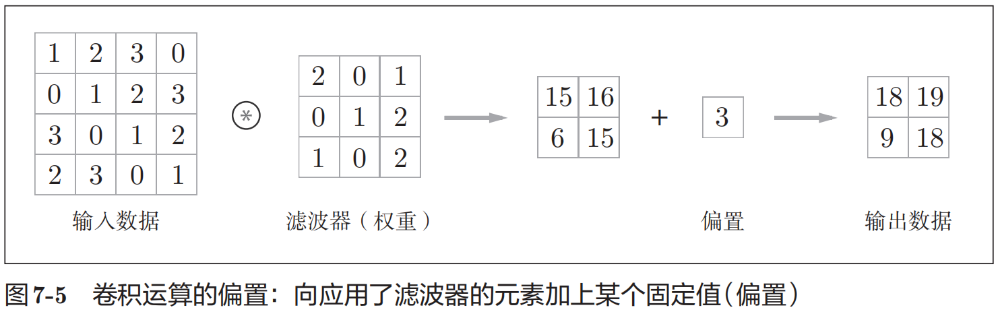

在进行卷积层的处理之前，有时要向输入数据的周围填入固定的数据（比如0等），这称为填充（padding），是卷积运算中经常会用到的处理。

应用滤波器的位置间隔称为步幅（stride）。

### 3维数据的卷积运算

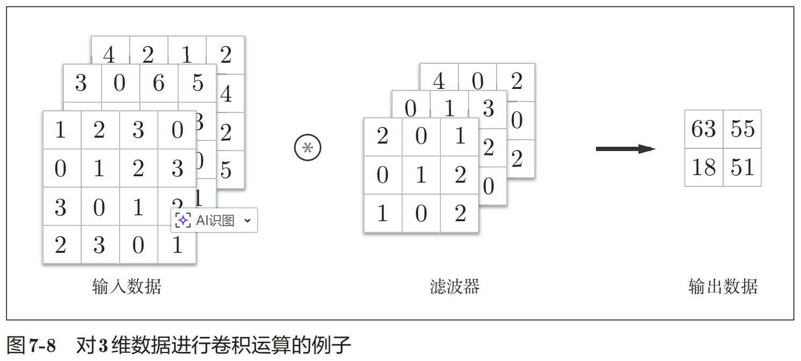

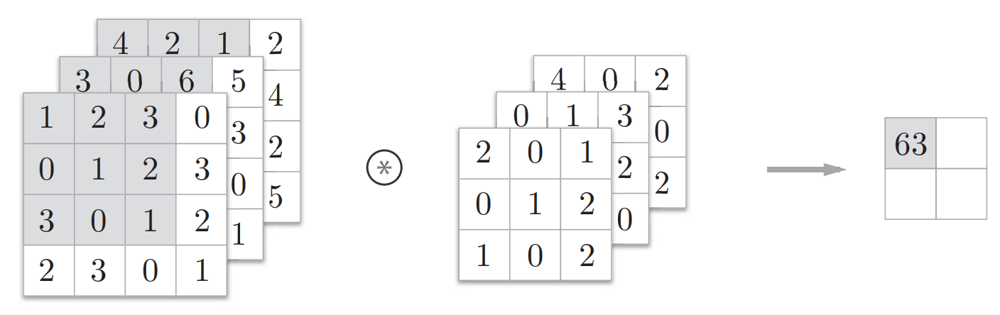

### 结合方块思考

将数据和滤波器结合长方体的方块来考虑，3维数据的卷积运算会很容易理解。方块是如图所示的3维长方体。把3维数据表示为多维数组时，书写顺序为（channel, height, width）。比如，通道数为C、高度为H、长度为W的数据的形状可以写成（C, H, W）。滤波器也一样，要按（channel, height, width）的顺序书写。比如，通道数为C、滤波器高度为FH（Filter Height）、长度为FW（Filter Width）时，可以写成（C, FH, FW）。

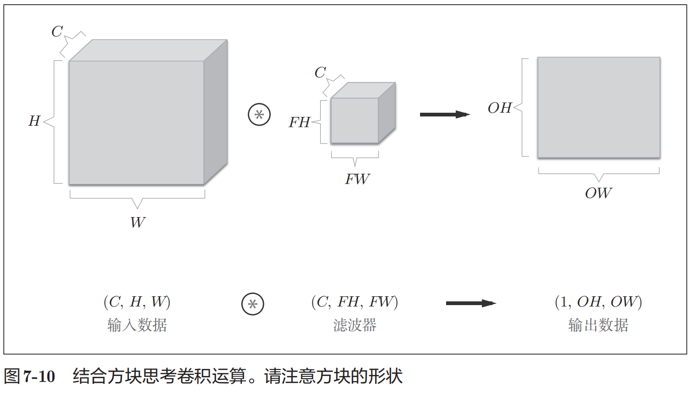

在这个例子中，数据输出是1张特征图。

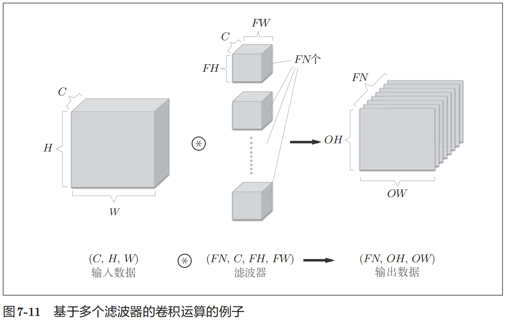

通过应用FN个滤波器，输出特征图也生成了FN个。如果将这FN个特征图汇集在一起，就得到了形状为(FN, OH, OW)的方块。将这个方块传给下一层，就是CNN的处理流。

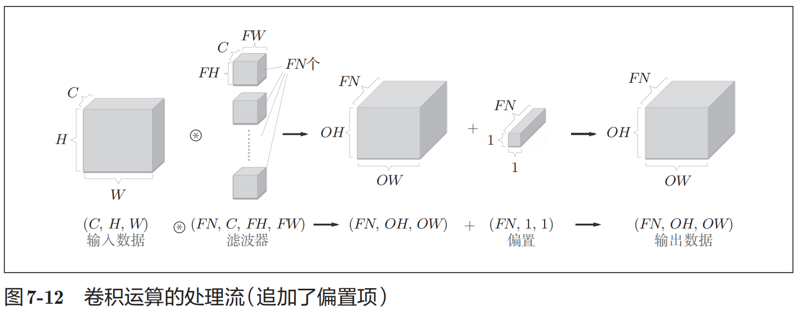

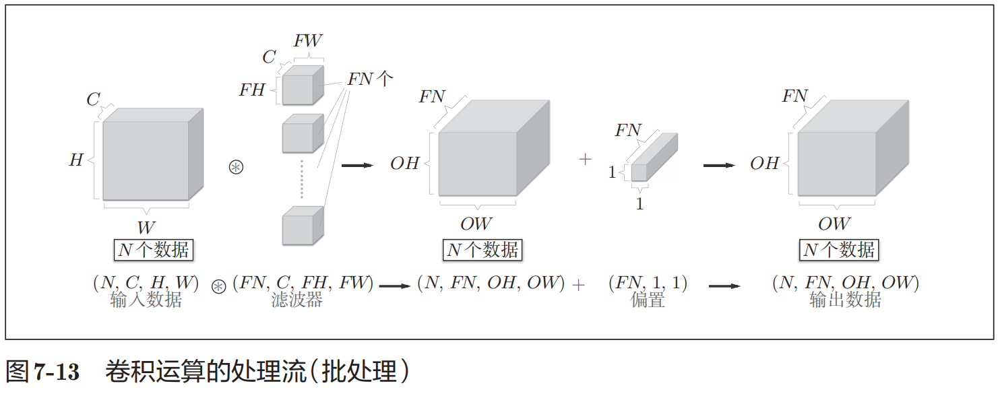

## 池化层

除了Max池化之外，还有Average池化等。相对于Max池化是从目标区域中取出最大值，Average池化则是计算目标区域的平均值。在图像识别领域，主要使用Max池化。

池化层的特征
1. 没有要学习的参数: 池化层和卷积层不同，没有要学习的参数。池化只是从目标区域中取最大值（或者平均值），所以不存在要学习的参数。
2. 通道数不发生变化: 经过池化运算，输入数据和输出数据的通道数不会发生变化。
3. 对微小的位置变化具有鲁棒性（健壮）: 输入数据发生微小偏差时，池化仍会返回相同的结果。因此，池化对输入数据的微小偏差具有鲁棒性。

## 代码实现

### 基于 im2col的展开

注意: 这里是性能优化！！！

im2col是一个函数，将输入数据展开以适合滤波器（权重）。如图所示，对3维的输入数据应用im2col后，数据转换为2维矩阵（正确地讲，是把包含批数量的4维数据转换成了2维数据）。

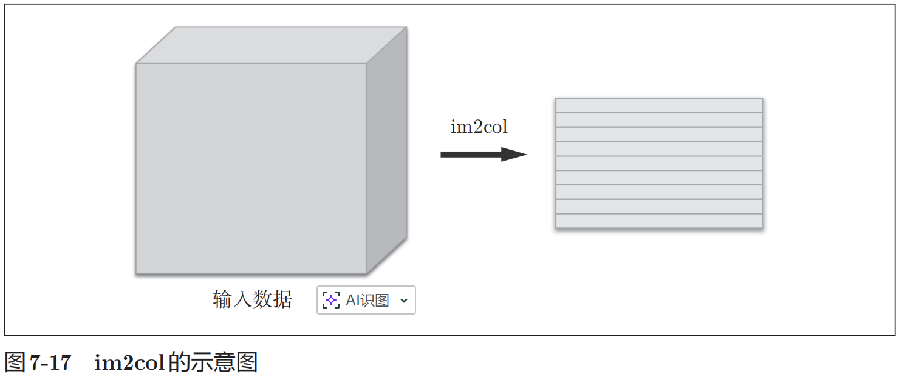

im2col会把输入数据展开以适合滤波器（权重）。具体地说，如图所示，对于输入数据，将应用滤波器的区域（3维方块）横向展开为1列。im2col会在所有应用滤波器的地方进行这个展开处理。

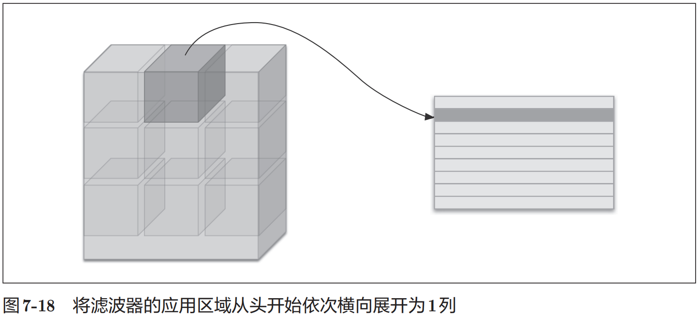

在图7-18中，为了便于观察，将步幅设置得很大，以使滤波器的应用区域不重叠。而在实际的卷积运算中，滤波器的应用区域几乎都是重叠的。在滤波器的应用区域重叠的情况下，使用im2col展开后，展开后的元素个数会多于原方块的元素个数。因此，使用im2col的实现存在比普通的实现消耗更多内存的缺点。但是，汇总成一个大的矩阵进行计算，对计算机的计算颇有益处。比如，在矩阵计算的库（线性代数库）等中，矩阵计算的实现已被高度最优化，可以高速地进行大矩阵的乘法运算。因此，通过归结到矩阵计算上，可以有效地利用线性代数库。

> im2col这个名称是“image to column”的缩写，翻译过来就是“从图像到矩阵”的意思。

使用im2col展开输入数据后，之后就只需将卷积层的滤波器（权重）纵向展开为1列，并计算2个矩阵的乘积即可（参照图-19）。这和全连接层的Affi ne层进行的处理基本相同。

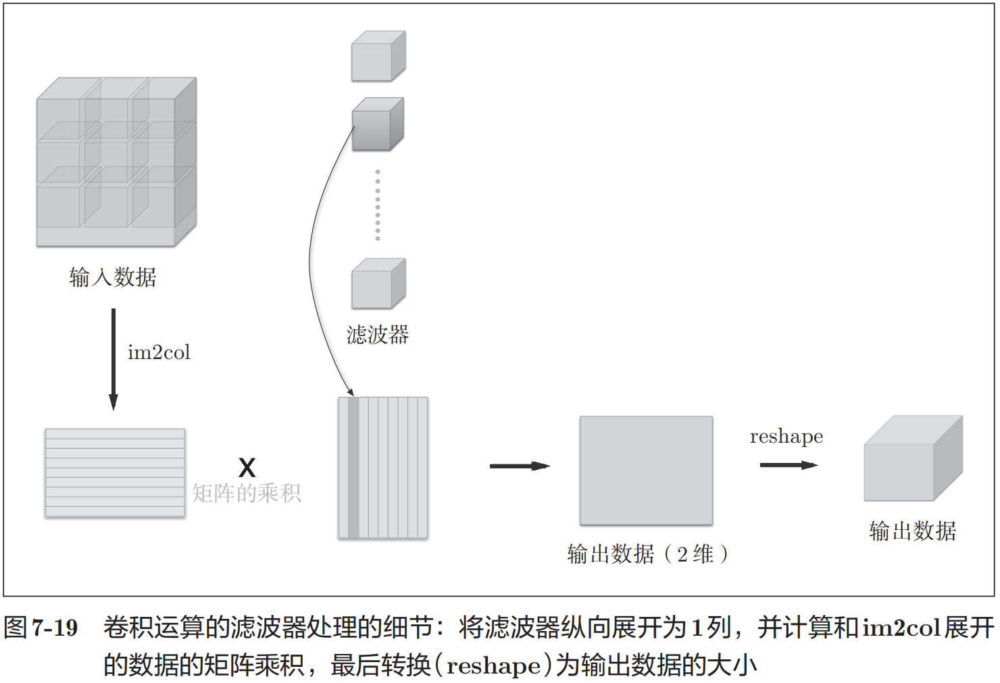

### 池化层的性能优化

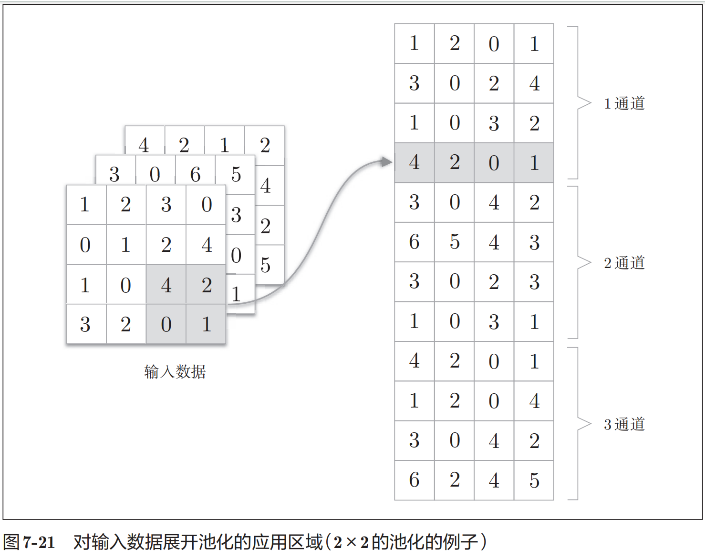

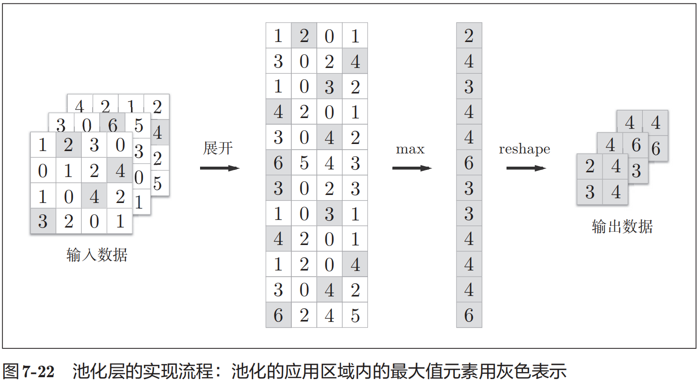

## CNN叠层

如果堆叠了多层卷积层，则随着层次加深，提取的信息也愈加复杂、抽象，这是深度学习中很有意思的一个地方。最开始的层对简单的边缘有响应，接下来的层对纹理有响应，再后面的层对更加复杂的物体部件有响应。也就是说，随着层次加深，神经元从简单的形状向“高级”信息变化。换句话说，就像我们理解东西的“含义”一样，响应的对象在逐渐变化。
