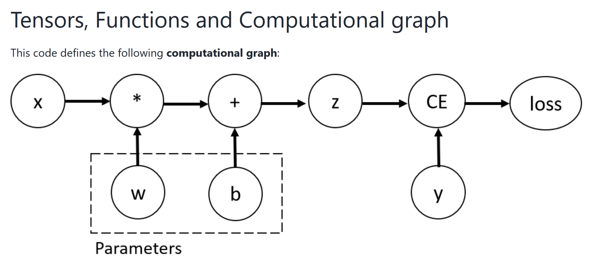

# Autograd mechanics

## 概念

autograd如何编码历史

Autograd是一个反向自动微分系统。从概念上讲，autograd记录了一个图形，记录了在您执行操作时创建数据的所有操作，给你一个有向无环图，它的叶子是输入张量，根是输出张量。通过从根到叶跟踪这个图，您可以使用链式规则自动计算梯度。

## 概念

在训练神经网络时，最常用的算法是反向传播，在该算法中，根据损失函数相对于给定参数的梯度来调整参数（模型权重）。

为了计算这些梯度，PyTorch有一个名为torch. auto的内置微分引擎。它支持自动计算任何计算图的梯度。


```python
def graph1():
    # 手动构建一个计算图, 线性: y = w*x + b
    # 1.构建输入输出
    x = torch.ones(5)  # 输入tensor
    y = torch.zeros(3)  # 预期输出, 也就是真实标签
    # 2.构建权重, 这个需要能够自动求导!
    w = torch.randn(5, 3, requires_grad=True)
    b = torch.randn(3, requires_grad=True)
    # 3.构建计算图
    # 前向传播
    z = torch.matmul(x, w) + b  # 实现y=w*x+b
    # 求取损失
    loss = torch.nn.functional.binary_cross_entropy_with_logits(z, y)

    print(f"Gradient function for z = {z.grad_fn}")
    print(f"Gradient function for loss = {loss.grad_fn}")

    loss.backward() # 反向传播!
    print(w.grad)
    print(b.grad)
```

以上代码对应的计算图如下：



在这个网络中，w和b是我们需要优化的参数。因此，我们需要能够计算损失函数相对于这些变量的梯度。
为了做到这一点，我们设置这些张量的requires_grad属性。

> 可以在创建张量时设置requires_grad的值，或者稍后使用x.requires_grad_（True）方法。

我们应用于张量以构造计算图的函数实际上是Function类的对象。该对象知道如何在正向计算函数，以及如何在反向传播步骤中计算其导数。对反向传播函数的引用存储在张量grad_fn属性中。

为了优化神经网络中参数的权重，我们需要计算损失函数相对于参数的导数，即，我们需要在x和y的一些固定值下的损失和损失。为了计算这些导数，我们调用loss.backward()，然后从w.grad和b.grad中检索值。

> 我们只能获得计算图的叶节点的梯度属性，这些叶节点requires_grad属性设置为True。对于图中的所有其他节点，梯度将不可用。
> 出于性能原因，我们只能在给定的图上使用backward()一次来执行梯度计算。如果我们需要在同一张图上进行多次backward()调用，我们需要将retain_graph=True传递给向后调用。


> 自动求导的属性默认是开启的，但是比如说模型推理的时候，就完全不需要反向传播，也就不需要求导，所以把自动求导关掉更好，这个时候，我们可以通过用torch.no_grad（）块包围计算代码来停止跟踪计算：

```python
z = torch.matmul(x, w)+b
print(z.requires_grad)

with torch.no_grad():
    z = torch.matmul(x, w)+b
print(z.requires_grad)
```

您可能想要禁用自动求导的原因如下：
 - 将神经网络中的某些参数标记为冻结参数。
 - 当您只进行前向传递时，为了加快计算速度，因为不跟踪梯度的张量上的计算会更有效。

## More on Computational Graphs

Conceptually, autograd keeps a record of data (tensors) and all executed operations (along with the resulting new tensors) in a directed acyclic graph (DAG) consisting of Function objects. In this DAG, leaves are the input tensors, roots are the output tensors. By tracing this graph from roots to leaves, you can automatically compute the gradients using the chain rule.

In a forward pass, autograd does two things simultaneously:

 - run the requested operation to compute a resulting tensor

 - maintain the operation’s gradient function in the DAG.

The backward pass kicks off when .backward() is called on the DAG root. autograd then:

 - computes the gradients from each .grad_fn,

 - accumulates them in the respective tensor’s .grad attribute

 - using the chain rule, propagates all the way to the leaf tensors.

> DAGs are dynamic in PyTorch An important thing to note is that the graph is recreated from scratch; after each .backward() call, autograd starts populating a new graph. This is exactly what allows you to use control flow statements in your model; you can change the shape, size and operations at every iteration if needed.
